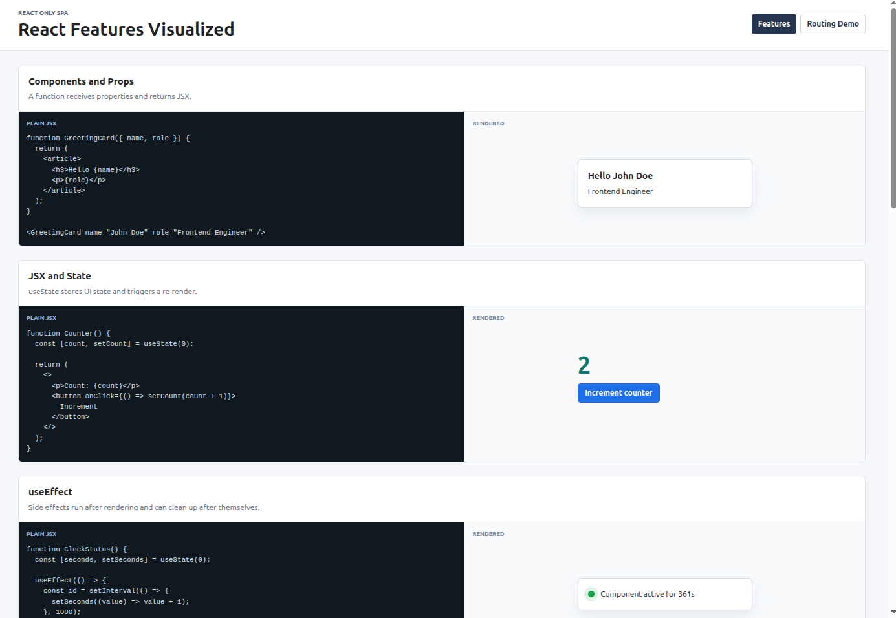

# React Feature SPA

This project is a Vite-powered React SPA that visualizes common React concepts side by side:
plain JSX/code on the left and the rendered result on the right.



## Included Examples

- Components and props
- JSX and local state with `useState`
- Side effects with `useEffect`
- DOM references with `useRef`
- Derived data caching with `useMemo`
- Explicit local state transitions with `useReducer`
- Reusable behavior with custom hooks
- Code splitting with `React.lazy` and `Suspense`
- Stable callback props with `useCallback` and `React.memo`
- Modals rendered through React portals
- Stable identity in lists with keys
- Dynamic route params with React Router
- Loading, success, error, and retry states for data fetching
- Controlled form inputs and conditional rendering
- Client-side routing with React Router
- State sharing with the Context API
- Global state management with Redux Toolkit
- Tests with Vitest, React Testing Library, MSW, and `expect`

## Scripts

```bash
npm run dev
npm run build
npm run lint
npm run test
npm run test:run
```

## Development

Start the local development server:

```bash
npm run dev
```

Open `http://localhost:5173/` in the browser.

## Testing

Run the test suite once:

```bash
npm run test:run
```

Run Vitest in watch mode:

```bash
npm run test
```
